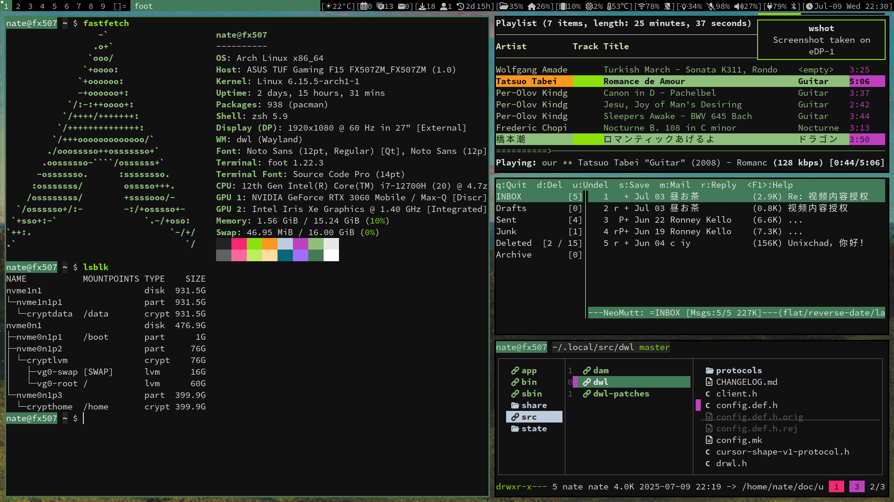
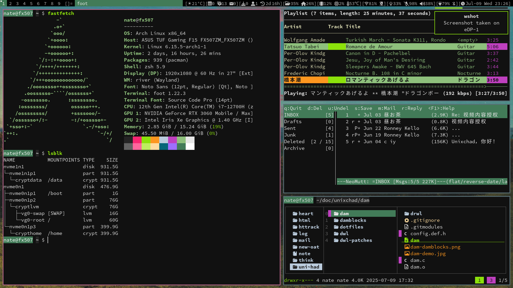

## My Arch Linux Install
[install.md](./install.md)

## What Is This?



## How To Use?
```sh
# Clone this repository on codeberg
git clone https://codeberg.org/unixchad/dotfiles
# Or on github
git clone https://github.com/gnuunixchad/dotfiles
# Create symlinks with GNU Stow
cd dotfiles
stow -t ~ . --adopt
```
A few software need manually setup:
- Software whose config files named to `*.example` for privacy reasons
- Software whose config files located outside of the `$HOME`
- Software listed in `./.stow-local-ignore`

> [!NOTE]
> For software I don't use anymore, check the git tags.

## Software Recommendation
```
- /usr/bin/sh:              dash
- Login Shell:              zsh
- Terminlal Multiplexer:    tmux
- Terminal Emulator:        foot
- Audio Server:             pipewire
- WM/Compositor:            dwl & river
- Status bar:               dam & damblocks
- Application Launcher:     wmenu
- Fuzzy Finder:             fzf
- Notification Daemon:      dunst
- Editor:                   neovim
- Email:                    neomutt & isync
- File manager:             lf
- Music player:             ncmpcpp & mpd
- Video player:             mpv
- Image Viewer:             swayimg
- Ebook Reader:             zathura & mupdf plugin
- Rss Feeder:               newsboat
- Calender:                 calcurse
- Todo:                     taskwarrior
- Virtulization:            kvm & qemu & libvirt
- Privacy/Security:         gpg & firejail & cryptsetup & sbctl
- Firefox Extension:        tridactyl & darkreader & ublock origin
- Downloader:               transmission-cli & yt-dlp & httrack
- Dotfiles Manager:         stow & git
```

## Chinese Video Channel
I have dedicated videos for almost every software I use, on how to use and ho
I configured them:

[unixchad at bilibili](https://space.bilibili.com/34569411)

Software I use to create videos:
- Screen Capture:   wf-recorder + slurp
- Voice Recording:  pw-record + noise-suppression-for-voice
- Video Editing:    kdenlive + ffmpeg
- Screenshots:      grim + slurp
- Thumbnails:       gimp + imagemagick

All emails from me will be signed by the same GPG key that I sign commits with  
- Import my key: `gpg --recv-keys 117094DA1AEA0835E4ED0770F7476912AA224CAC`
- Download or copy at [here](./unixchad.asc)

## License
I am the author of every file with the following disclaimer:
```sh
# @author nate zhou
```
I license them under the [GNU GPL-3.0](./LICENSE). There is no warranty, to
the extend permitted by applicable law.

A few scripts or config files come from others, and a credit to the respective
authors should be spotted.
