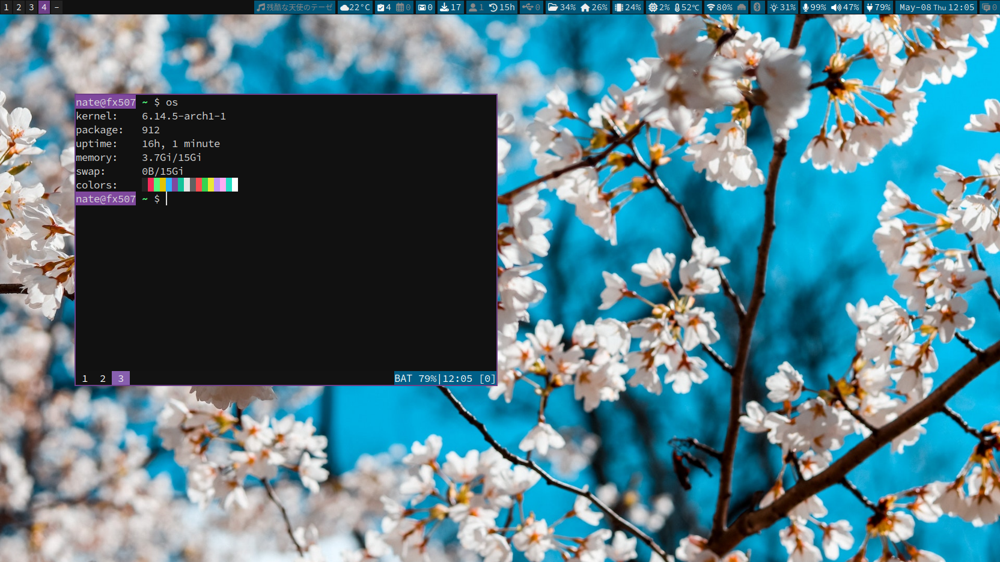
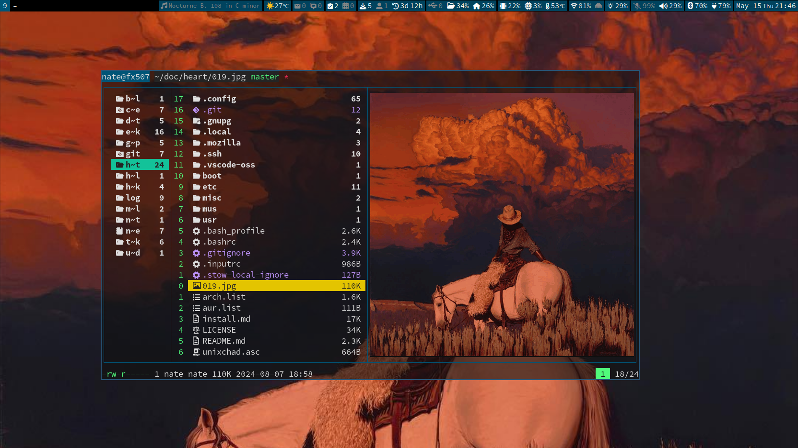
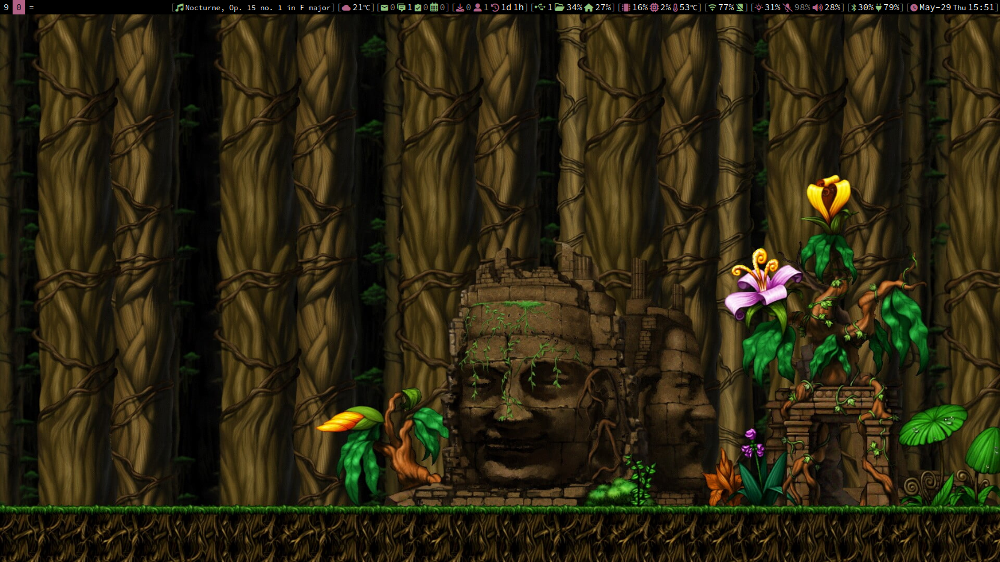

## My Arch Linux Install
[install.md](./install.md)

## What Is This?





## How To Use?
```sh
# Clone this repository on codeberg
git clone https://codeberg.org/unixchad/dotfiles
# Or on github
git clone https://github.com/gnuunixchad/dotfiles
# Create symlinks with GNU Stow
cd dotfiles
stow -t ~ . --adopt
```
A few software need manually setup:
- Software whose config files named to `*.example` for privacy reasons
- Software whose config files located outside of the `$HOME`
- Software listed in `./.stow-local-ignore`

## Software I Use Everyday
```
- Default Shell:            dash
- Interactive Shell:        bash/zsh
- Terminlal Multiplexer:    tmux
- WM/Compositor:            sway
- Status bar:               i3blocks
- Launcher:                 wmenu
- Notification:             dunst
- Terminal Emulator:        foot
- Editor:                   neovim
- Email Client:             neomutt/isync
- File manager:             lf
- Music player:             ncmpcpp
- Video player:             mpv
- Image Viewer:             swayimg
- Ebook Reader:             zathura
- Rss Feeder:               newsboat
- Calender:                 calcurse
- Todo:                     taskwarrior
- Virtulization             kvm/qemu/libvirt
```

## Chinese Video Channel
I have dedicated videos for almost every software I use, on how to use and ho
I configured them:

[unixchad at bilibili](https://space.bilibili.com/34569411)

Software I use to create videos:
- Screen Capture:   wf-recorder + slurp
- Voice Recording:  pw-record + noise-suppression-for-voice
- Video Editing:    kdenlive + ffmpeg
- Screenshots:      grim + slurp
- Thumbnails:       gimp + imagemagick

All emails from me will be signed by the same GPG key that I sign commits with  
- Import my key: `gpg --recv-keys 117094DA1AEA0835E4ED0770F7476912AA224CAC`
- Download or copy at [here](./unixchad.asc)

## License
I am the author of every file with the following disclaimer:
```sh
# @author nate zhou
```
I license them under the [GNU GPL-3.0](./LICENSE). There is no warranty, to
the extend permitted by applicable law.

A few scripts or config files come from others, and a credit to the respective
authors should be spotted.
